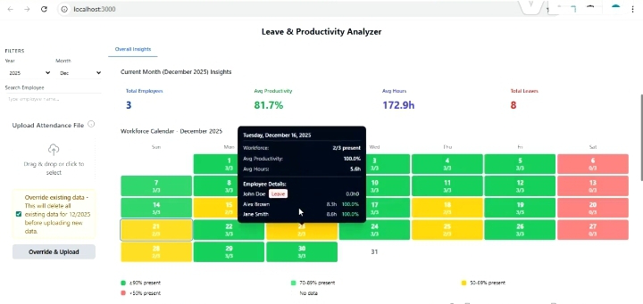

<p align="center">
    
</p>
<p align="center"><h1 align="center">EMPLOYEE PERFORMANCE ANALYZER</h1></p>
<p align="center">
	<em><code>Leave & Productivity Analysis</code></em>
</p>
<p align="center">
	
	
	
	
	
	
</p>
<p align="center">
	
	
	
	
	
</p>
<br>

## 🔗 Table of Contents

- [📍 Overview](#-overview)
- [🎥 Video Demonstration](#-video-demonstration)
- [👾 Features](#-features)
- [📁 Project Structure](#-project-structure)
  - [📂 Project Index](#-project-index)
- [🚀 Getting Started](#-getting-started)
  - [☑️ Prerequisites](#️-prerequisites)
  - [⚙️ Installation](#️-installation)
  - [🤖 Usage](#-usage)
  - [🧪 Testing](#-testing)
- [📌 Project Roadmap](#-project-roadmap)
- [🔰 Contributing](#-contributing)
- [📞 Support & Contact](#-support--contact)
---

## 📍 Overview

**Leave Productivity Analyzer** is a comprehensive workforce management platform that transforms raw attendance data into actionable business intelligence. The system analyzes leave patterns, tracks productivity metrics, and provides data-driven insights to optimize workforce planning and resource allocation. Built for HR departments and team managers, it offers intuitive visualizations and predictive analytics to enhance organizational efficiency.

**Key Value Proposition:**
- 📈 **Data-Driven Decisions**: Convert attendance logs into strategic insights
- ⚡ **Real-Time Analytics**: Monitor workforce productivity with live dashboards
- 🔍 **Predictive Analysis**: Forecast leave trends and capacity planning
- 📊 **Multi-Dimensional Views**: Analyze data by department, team, or individual

---

## 🎥 Video Demonstration

[](https://drive.google.com/file/d/1p0p_v4MhUiboTZjmCa7lsx3oqX3S9Zz0/view?usp=drive_link)

*If unable to see the demo video try the fllowiing :*


<a href="https://drive.google.com/file/d/1p0p_v4MhUiboTZjmCa7lsx3oqX3S9Zz0/view?usp=drive_link" target="_blank">
  
</a>


<a href="./demo.mp4" download>
  
</a>


---

## 👾 Features

### 🎯 **Core Features**
- **📁 Excel Data Integration**: Bulk upload monthly attendance Excel files with automatic parsing
- **👤 Employee Productivity Tracking**: Individual performance metrics and leave patterns
- **📅 Interactive Calendar Views**: Visual workforce availability across months and years
- **📊 Advanced Data Visualization**: Interactive charts using Chart.js/Recharts
- **🔍 Smart Search & Filter**: Find employees, filter by departments, date ranges

### 📈 **Analytics & Insights**
- **Year-over-Year Comparison**: Track productivity changes across fiscal years
- **Productivity Trend Lines**: Identify seasonal patterns and anomalies
- **Attendance Heatmaps**: Visualize workforce concentration across calendar

### 🛠 **Technical Features**
- **RESTful API Architecture**: Scalable backend with proper error handling
- **Real-time Data Processing**: Immediate feedback on file uploads and queries
- **Responsive UI**: Mobile-friendly dashboard with Tailwind CSS
- **Modular Component Design**: Reusable React components

---

## 📁 Project Structure

```sh
└── leave-productivity-analyzer/
    ├── Data 2024/
    │   ├── April_2024.xlsx
    │   ├── August_2024.xlsx
    │   ├── December_2024.xlsx
    │   ├── February_2024.xlsx
    │   ├── January_2024.xlsx
    │   ├── July_2024.xlsx
    │   ├── June_2024.xlsx
    │   ├── March_2024.xlsx
    │   ├── May_2024.xlsx
    │   ├── November_2024.xlsx
    │   ├── October_2024.xlsx
    │   └── September_2024.xlsx
    ├── Data 2025/
    │   ├── December_2025.xlsx
    │   ├── February_2025.xlsx
    │   ├── January_2025.xlsx
    │   └── March_2025.xlsx
    ├── api/
    │   ├── .gitignore
    │   ├── config/
    │   ├── controllers/
    │   ├── index.js
    │   ├── middleware/
    │   ├── models/
    │   ├── package-lock.json
    │   ├── package.json
    │   ├── routes/
    │   ├── server.old.js
    │   ├── src/
    │   ├── upload.js
    │   └── utils/
    ├── frontend/
    │   ├── package-lock.json
    │   ├── package-lock.zip
    │   ├── package.json
    │   ├── postcss.config.js
    │   ├── public/
    │   ├── setup.ps1
    │   ├── src/
    │   └── tailwind.config.js
    ├── package-lock.json
    ├── package.json
    └── vercel.json
```

### 📂 Project Index
<details open>
	<summary><b><code>LEAVE-PRODUCTIVITY-ANALYZER/</code></b></summary>
	<details> <!-- __root__ Submodule -->
		<summary><b>__root__</b></summary>
		<blockquote>
			<table>
			<tr>
				<td><b><a href='https://github.com/Nitya-Nivdunge/leave-productivity-analyzer/blob/master/package-lock.json'>package-lock.json</a></b></td>
				<td>Main project dependency lock file</td>
			</tr>
			<tr>
				<td><b><a href='https://github.com/Nitya-Nivdunge/leave-productivity-analyzer/blob/master/vercel.json'>vercel.json</a></b></td>
				<td>Vercel deployment configuration</td>
			</tr>
			<tr>
				<td><b><a href='https://github.com/Nitya-Nivdunge/leave-productivity-analyzer/blob/master/package.json'>package.json</a></b></td>
				<td>Root project configuration and scripts</td>
			</tr>
			</table>
		</blockquote>
	</details>
	<details> <!-- api Submodule -->
		<summary><b>api</b></summary>
		<blockquote>
			<table>
			<tr>
				<td><b><a href='https://github.com/Nitya-Nivdunge/leave-productivity-analyzer/blob/master/api/package-lock.json'>package-lock.json</a></b></td>
				<td>Backend dependency lock file</td>
			</tr>
			<tr>
				<td><b><a href='https://github.com/Nitya-Nivdunge/leave-productivity-analyzer/blob/master/api/upload.js'>upload.js</a></b></td>
				<td>File upload middleware configuration</td>
			</tr>
			<tr>
				<td><b><a href='https://github.com/Nitya-Nivdunge/leave-productivity-analyzer/blob/master/api/server.old.js'>server.old.js</a></b></td>
				<td>Legacy server implementation</td>
			</tr>
			<tr>
				<td><b><a href='https://github.com/Nitya-Nivdunge/leave-productivity-analyzer/blob/master/api/index.js'>index.js</a></b></td>
				<td>Main server entry point</td>
			</tr>
			<tr>
				<td><b><a href='https://github.com/Nitya-Nivdunge/leave-productivity-analyzer/blob/master/api/package.json'>package.json</a></b></td>
				<td>Backend dependencies and scripts</td>
			</tr>
			</table>
			<details>
				<summary><b>src</b></summary>
				<blockquote>
					<details>
						<summary><b>config</b></summary>
						<blockquote>
							<table>
							<tr>
								<td><b><a href='https://github.com/Nitya-Nivdunge/leave-productivity-analyzer/blob/master/api/src/config/db.js'>db.js</a></b></td>
								<td>MongoDB database connection setup</td>
							</tr>
							</table>
						</blockquote>
					</details>
					<details>
						<summary><b>controllers</b></summary>
						<blockquote>
							<table>
							<tr>
								<td><b><a href='https://github.com/Nitya-Nivdunge/leave-productivity-analyzer/blob/master/api/src/controllers/attendanceController.js'>attendanceController.js</a></b></td>
								<td>Attendance data processing logic</td>
							</tr>
							<tr>
								<td><b><a href='https://github.com/Nitya-Nivdunge/leave-productivity-analyzer/blob/master/api/src/controllers/uploadController.js'>uploadController.js</a></b></td>
								<td>Excel file upload and processing logic</td>
							</tr>
							</table>
						</blockquote>
					</details>
					<details>
						<summary><b>models</b></summary>
						<blockquote>
							<table>
							<tr>
								<td><b><a href='https://github.com/Nitya-Nivdunge/leave-productivity-analyzer/blob/master/api/src/models/Employee.js'>Employee.js</a></b></td>
								<td>Employee data schema and model</td>
							</tr>
							<tr>
								<td><b><a href='https://github.com/Nitya-Nivdunge/leave-productivity-analyzer/blob/master/api/src/models/Attendance.js'>Attendance.js</a></b></td>
								<td>Attendance record schema and model</td>
							</tr>
							</table>
						</blockquote>
					</details>
					<details>
						<summary><b>routes</b></summary>
						<blockquote>
							<table>
							<tr>
								<td><b><a href='https://github.com/Nitya-Nivdunge/leave-productivity-analyzer/blob/master/api/src/routes/apiRoutes.js'>apiRoutes.js</a></b></td>
								<td>API endpoint definitions and routing</td>
							</tr>
							</table>
						</blockquote>
					</details>
					<details>
						<summary><b>utils</b></summary>
						<blockquote>
							<table>
							<tr>
								<td><b><a href='https://github.com/Nitya-Nivdunge/leave-productivity-analyzer/blob/master/api/src/utils/helpers.js'>helpers.js</a></b></td>
								<td>Utility functions and helper methods</td>
							</tr>
							</table>
						</blockquote>
					</details>
					<details>
						<summary><b>middleware</b></summary>
						<blockquote>
							<table>
							<tr>
								<td><b><a href='https://github.com/Nitya-Nivdunge/leave-productivity-analyzer/blob/master/api/src/middleware/upload.js'>upload.js</a></b></td>
								<td>File upload middleware with validation</td>
							</tr>
							</table>
						</blockquote>
					</details>
				</blockquote>
			</details>
			<details>
				<summary><b>config</b></summary>
				<blockquote>
					<table>
					<tr>
						<td><b><a href='https://github.com/Nitya-Nivdunge/leave-productivity-analyzer/blob/master/api/config/db.js'>db.js</a></b></td>
						<td>Database configuration file</td>
					</tr>
					</table>
				</blockquote>
			</details>
			<details>
				<summary><b>controllers</b></summary>
				<blockquote>
					<table>
					<tr>
						<td><b><a href='https://github.com/Nitya-Nivdunge/leave-productivity-analyzer/blob/master/api/controllers/attendanceController.js'>attendanceController.js</a></b></td>
						<td>Attendance data business logic</td>
					</tr>
					<tr>
						<td><b><a href='https://github.com/Nitya-Nivdunge/leave-productivity-analyzer/blob/master/api/controllers/uploadController.js'>uploadController.js</a></b></td>
						<td>File upload handling logic</td>
					</tr>
					</table>
				</blockquote>
			</details>
			<details>
				<summary><b>models</b></summary>
				<blockquote>
					<table>
					<tr>
						<td><b><a href='https://github.com/Nitya-Nivdunge/leave-productivity-analyzer/blob/master/api/models/Employee.js'>Employee.js</a></b></td>
						<td>Employee MongoDB model</td>
					</tr>
					<tr>
						<td><b><a href='https://github.com/Nitya-Nivdunge/leave-productivity-analyzer/blob/master/api/models/Attendance.js'>Attendance.js</a></b></td>
						<td>Attendance MongoDB model</td>
					</tr>
					</table>
				</blockquote>
			</details>
			<details>
				<summary><b>routes</b></summary>
				<blockquote>
					<table>
					<tr>
						<td><b><a href='https://github.com/Nitya-Nivdunge/leave-productivity-analyzer/blob/master/api/routes/apiRoutes.js'>apiRoutes.js</a></b></td>
						<td>API route definitions</td>
					</tr>
					</table>
				</blockquote>
			</details>
			<details>
				<summary><b>utils</b></summary>
				<blockquote>
					<table>
					<tr>
						<td><b><a href='https://github.com/Nitya-Nivdunge/leave-productivity-analyzer/blob/master/api/utils/helpers.js'>helpers.js</a></b></td>
						<td>Helper functions for data processing</td>
					</tr>
					</table>
				</blockquote>
			</details>
			<details>
				<summary><b>middleware</b></summary>
				<blockquote>
					<table>
					<tr>
						<td><b><a href='https://github.com/Nitya-Nivdunge/leave-productivity-analyzer/blob/master/api/middleware/upload.js'>upload.js</a></b></td>
						<td>Middleware for file uploads</td>
					</tr>
					</table>
				</blockquote>
			</details>
		</blockquote>
	</details>
	<details> <!-- frontend Submodule -->
		<summary><b>frontend</b></summary>
		<blockquote>
			<table>
			<tr>
				<td><b><a href='https://github.com/Nitya-Nivdunge/leave-productivity-analyzer/blob/master/frontend/postcss.config.js'>postcss.config.js</a></b></td>
				<td>PostCSS configuration for CSS processing</td>
			</tr>
			<tr>
				<td><b><a href='https://github.com/Nitya-Nivdunge/leave-productivity-analyzer/blob/master/frontend/package-lock.json'>package-lock.json</a></b></td>
				<td>Frontend dependency lock file</td>
			</tr>
			<tr>
				<td><b><a href='https://github.com/Nitya-Nivdunge/leave-productivity-analyzer/blob/master/frontend/tailwind.config.js'>tailwind.config.js</a></b></td>
				<td>Tailwind CSS configuration</td>
			</tr>
			<tr>
				<td><b><a href='https://github.com/Nitya-Nivdunge/leave-productivity-analyzer/blob/master/frontend/setup.ps1'>setup.ps1</a></b></td>
				<td>Windows PowerShell setup script</td>
			</tr>
			<tr>
				<td><b><a href='https://github.com/Nitya-Nivdunge/leave-productivity-analyzer/blob/master/frontend/package.json'>package.json</a></b></td>
				<td>Frontend dependencies and scripts</td>
			</tr>
			</table>
			<details>
				<summary><b>src</b></summary>
				<blockquote>
					<table>
					<tr>
						<td><b><a href='https://github.com/Nitya-Nivdunge/leave-productivity-analyzer/blob/master/frontend/src/index.css'>index.css</a></b></td>
						<td>Global CSS styles</td>
					</tr>
					<tr>
						<td><b><a href='https://github.com/Nitya-Nivdunge/leave-productivity-analyzer/blob/master/frontend/src/App.js'>App.js</a></b></td>
						<td>Main React application component</td>
					</tr>
					<tr>
						<td><b><a href='https://github.com/Nitya-Nivdunge/leave-productivity-analyzer/blob/master/frontend/src/index.js'>index.js</a></b></td>
						<td>React application entry point</td>
					</tr>
					</table>
					<details>
						<summary><b>components</b></summary>
						<blockquote>
							<table>
							<tr>
								<td><b><a href='https://github.com/Nitya-Nivdunge/leave-productivity-analyzer/blob/master/frontend/src/components/EmployeeSearch.js'>EmployeeSearch.js</a></b></td>
								<td>Employee search and filter component</td>
							</tr>
							<tr>
								<td><b><a href='https://github.com/Nitya-Nivdunge/leave-productivity-analyzer/blob/master/frontend/src/components/MonthSelector.js'>MonthSelector.js</a></b></td>
								<td>Month selection dropdown component</td>
							</tr>
							<tr>
								<td><b><a href='https://github.com/Nitya-Nivdunge/leave-productivity-analyzer/blob/master/frontend/src/components/YearComparisonChart.js'>YearComparisonChart.js</a></b></td>
								<td>Year-over-year comparison visualization</td>
							</tr>
							<tr>
								<td><b><a href='https://github.com/Nitya-Nivdunge/leave-productivity-analyzer/blob/master/frontend/src/components/Statistics.js'>Statistics.js</a></b></td>
								<td>Statistical summary display component</td>
							</tr>
							<tr>
								<td><b><a href='https://github.com/Nitya-Nivdunge/leave-productivity-analyzer/blob/master/frontend/src/components/WorkforceCalendarView.js'>WorkforceCalendarView.js</a></b></td>
								<td>Workforce calendar visualization</td>
							</tr>
							<tr>
								<td><b><a href='https://github.com/Nitya-Nivdunge/leave-productivity-analyzer/blob/master/frontend/src/components/OverallProductivityChart.js'>OverallProductivityChart.js</a></b></td>
								<td>Overall productivity trend chart</td>
							</tr>
							<tr>
								<td><b><a href='https://github.com/Nitya-Nivdunge/leave-productivity-analyzer/blob/master/frontend/src/components/Dashboard.js'>Dashboard.js</a></b></td>
								<td>Main dashboard layout component</td>
							</tr>
							<tr>
								<td><b><a href='https://github.com/Nitya-Nivdunge/leave-productivity-analyzer/blob/master/frontend/src/components/CalendarView.js'>CalendarView.js</a></b></td>
								<td>Interactive calendar component</td>
							</tr>
							<tr>
								<td><b><a href='https://github.com/Nitya-Nivdunge/leave-productivity-analyzer/blob/master/frontend/src/components/FileUpload.js'>FileUpload.js</a></b></td>
								<td>Excel file upload interface</td>
							</tr>
							<tr>
								<td><b><a href='https://github.com/Nitya-Nivdunge/leave-productivity-analyzer/blob/master/frontend/src/components/OverallInsights.js'>OverallInsights.js</a></b></td>
								<td>Insights and recommendations display</td>
							</tr>
							<tr>
								<td><b><a href='https://github.com/Nitya-Nivdunge/leave-productivity-analyzer/blob/master/frontend/src/components/AttendanceTable.js'>AttendanceTable.js</a></b></td>
								<td>Attendance data table component</td>
							</tr>
							</table>
							<details>
								<summary><b>Charts</b></summary>
								<blockquote>
									<table>
									<tr>
										<td><b><a href='https://github.com/Nitya-Nivdunge/leave-productivity-analyzer/blob/master/frontend/src/components/Charts/ProductivityChart.js'>ProductivityChart.js</a></b></td>
										<td>Productivity visualization chart component</td>
									</tr>
									</table>
								</blockquote>
							</details>
						</blockquote>
					</details>
					<details>
						<summary><b>services</b></summary>
						<blockquote>
							<table>
							<tr>
								<td><b><a href='https://github.com/Nitya-Nivdunge/leave-productivity-analyzer/blob/master/frontend/src/services/api.js'>api.js</a></b></td>
								<td>API service layer for backend communication</td>
							</tr>
							</table>
						</blockquote>
					</details>
				</blockquote>
			</details>
			<details>
				<summary><b>public</b></summary>
				<blockquote>
					<table>
					<tr>
						<td><b><a href='https://github.com/Nitya-Nivdunge/leave-productivity-analyzer/blob/master/frontend/public/index.html'>index.html</a></b></td>
						<td>Main HTML template file</td>
					</tr>
					</table>
				</blockquote>
			</details>
		</blockquote>
	</details>
</details>

---
## 🚀 Getting Started

### ☑️ Prerequisites

Before getting started with leave-productivity-analyzer, ensure your runtime environment meets the following requirements:

- **Node.js:** v16 or higher
- **npm:** v8 or higher (or yarn)
- **MongoDB:** Local instance or MongoDB Atlas account
- **Git:** For version control

### ⚙️ Installation

Install leave-productivity-analyzer using one of the following methods:

**Build from source:**

1. Clone the leave-productivity-analyzer repository:
```bash
git clone https://github.com/Nitya-Nivdunge/leave-productivity-analyzer
```

2. Navigate to the project directory:
```bash
cd leave-productivity-analyzer
```

3. Install the project dependencies:

**Backend Setup:**
```bash
cd api
npm install
```

**Frontend Setup:**
```bash
cd ../frontend
npm install
```

4. **Environment Configuration:**
Create a `.env` file in the `api/` directory:
```env
MONGODB_URI=your_mongodb_connection_string
PORT=5000
NODE_ENV=development
```

### 🤖 Usage

Run leave-productivity-analyzer using the following commands:

**Start Backend Server:**
```bash
cd api
npm start
# or for development with hot reload
npm run dev
```

**Start Frontend Application:**
```bash
cd frontend
npm start
```

The application will be available at:
- Frontend: http://localhost:3000
- Backend API: http://localhost:5000

### 🧪 Testing

Run the test suite using the following commands:

**Backend Tests:**
```bash
cd api
npm test
```

**Frontend Tests:**
```bash
cd frontend
npm test
```

**End-to-End Tests:**
```bash
npm run test:e2e
```

---
## 📌 Project Roadmap

### ✅ **Completed (v1.0)**
- [X] **Core Architecture**: MVC backend with Express.js
- [X] **Excel Parser**: Automated attendance data extraction
- [X] **Dashboard UI**: Responsive React dashboard with Tailwind CSS
- [X] **Basic Analytics**: Monthly/yearly comparison charts
- [X] **Data Upload**: Excel file processing system
- [X] **Database Integration**: MongoDB with Mongoose ODM

### 🔄 **In Progress (v1.1)**
- [ ] **Authentication**: JWT-based user authentication system
- [ ] **Advanced Analytics**: Predictive leave forecasting algorithms
- [ ] **Export Features**: PDF/Excel report generation
- [ ] **Notifications**: Email alerts for critical leave patterns
- [ ] **Role-based Access**: Admin/Manager/Employee permission levels

### 📅 **Planned (v2.0)**
- [ ] **AI Integration**: Machine learning for productivity predictions
- [ ] **Mobile App**: React Native companion application
- [ ] **API Documentation**: Swagger/OpenAPI specifications
- [ ] **Multi-tenant Support**: Department and team isolation
- [ ] **Real-time Updates**: WebSocket integration for live data

---

## 🔰 Contributing

We welcome contributions from the community! Here's how you can help:

- **💬 [Join the Discussions](https://github.com/Nitya-Nivdunge/leave-productivity-analyzer/discussions)**: Share your insights, provide feedback, or ask questions.
- **🐛 [Report Issues](https://github.com/Nitya-Nivdunge/leave-productivity-analyzer/issues)**: Submit bugs found or log feature requests.
- **💡 [Submit Pull Requests](https://github.com/Nitya-Nivdunge/leave-productivity-analyzer/pulls)**: Review open PRs, and submit your own PRs.

<details closed>
<summary>Contributing Guidelines</summary>

1. **Fork the Repository**: Start by forking the project repository to your GitHub account.
2. **Clone Locally**: Clone the forked repository to your local machine using a git client.
   ```bash
   git clone https://github.com/YOUR_USERNAME/leave-productivity-analyzer
   ```
3. **Create a New Branch**: Always work on a new branch, giving it a descriptive name.
   ```bash
   git checkout -b feature/amazing-feature
   ```
4. **Make Your Changes**: Develop and test your changes locally.
5. **Commit Your Changes**: Commit with a clear message describing your updates.
   ```bash
   git commit -m 'Implemented new feature: Amazing Feature'
   ```
6. **Push to GitHub**: Push the changes to your forked repository.
   ```bash
   git push origin feature/amazing-feature
   ```
7. **Submit a Pull Request**: Create a PR against the original project repository. Clearly describe the changes and their motivations.
8. **Review**: Once your PR is reviewed and approved, it will be merged into the main branch.

</details>

<details closed>
<summary>Contributor Graph</summary>
<br>
<p align="left">
   <a href="https://github.com/Nitya-Nivdunge/leave-productivity-analyzer/graphs/contributors">
      
   </a>
</p>
</details>

---

### **Learning Resources**
- [React Documentation](https://reactjs.org/docs/getting-started.html)
- [Express.js Guide](https://expressjs.com/en/guide/routing.html)
- [MongoDB Documentation](https://docs.mongodb.com/)
- [Chart.js Examples](https://www.chartjs.org/docs/latest/samples/)
- [Tailwind CSS Documentation](https://tailwindcss.com/docs)

### **Inspiration**
- Modern HR analytics platforms
- Data visualization best practices
- Open-source community projects
- Academic research on workforce productivity

---

## 📞 Support & Contact

**Project Maintainer:** Nitya Nivdunge  
**GitHub:** [@Nitya-Nivdunge](https://github.com/Nitya-Nivdunge)  
**Project Repository:** [https://github.com/Nitya-Nivdunge/leave-productivity-analyzer](https://github.com/Nitya-Nivdunge/leave-productivity-analyzer)

**Need Help?**
- 📖 Check the project [Wiki](https://github.com/Nitya-Nivdunge/leave-productivity-analyzer/wiki) for detailed documentation
- 💬 Join our [Discussions](https://github.com/Nitya-Nivdunge/leave-productivity-analyzer/discussions) for community support
- 🐛 Report bugs or issues on our [Issues Tracker](https://github.com/Nitya-Nivdunge/leave-productivity-analyzer/issues)
- 📧 For direct inquiries, please use GitHub discussions
---
